# FPGA_Internship_Screening
Verilog implementation and simulation of multiplexer designs using Yosys, Icarus Verilog, and GTKWave with waveform analysis.

## 📌 Overview
This repository contains the Verilog implementation and simulation of multiplexer (MUX) designs as part of FPGA RTL design and synthesis learning. The design is simulated using Icarus Verilog and visualized using GTKWave.

---

## 🎯 Objectives
- Design a multiplexer using Verilog HDL
- Simulate the design using Icarus Verilog
- Analyze waveforms using GTKWave
- Understand RTL design and logic synthesis using Yosys

---

## 🧠 Tools Used
- Icarus Verilog (iverilog)
- GTKWave
- Yosys

---

# 📦 MODULE 1: MULTIPLEXER (MUX)

## 📜 Verilog Files
- `good_mux.v` – RTL design of multiplexer
- `tb_good_mux.v` – Testbench for simulation

## 📊 Simulation Output

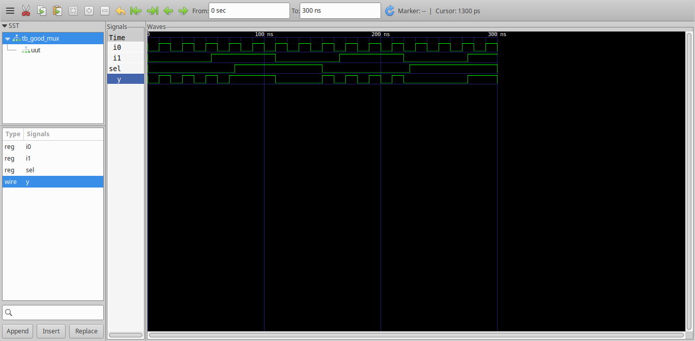

## 🔧 Synthesis Output

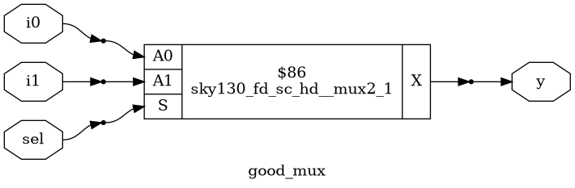

---

# 📦 MODULE 2: D FLIP-FLOPS

## 🔹 1. DFF with Asynchronous SET

### 📊 GTKWave Outputs
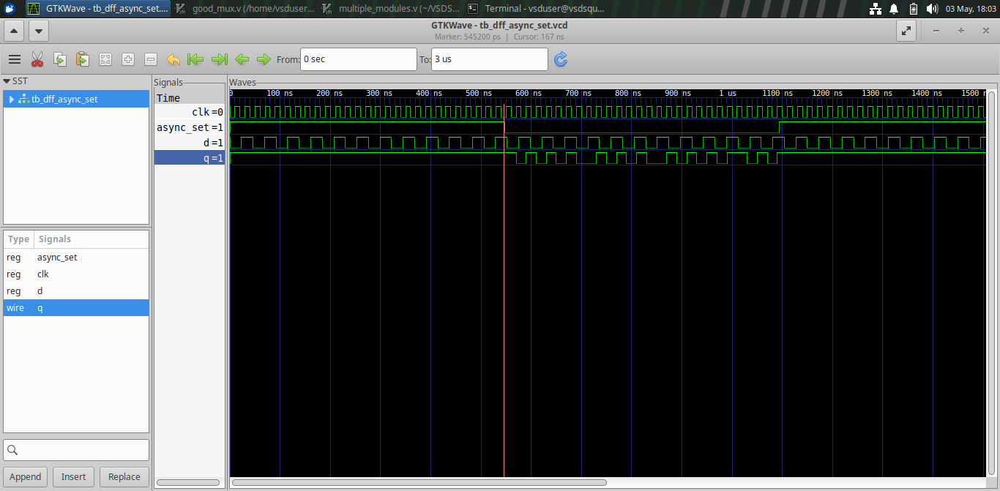

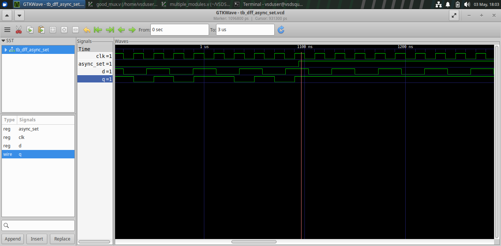

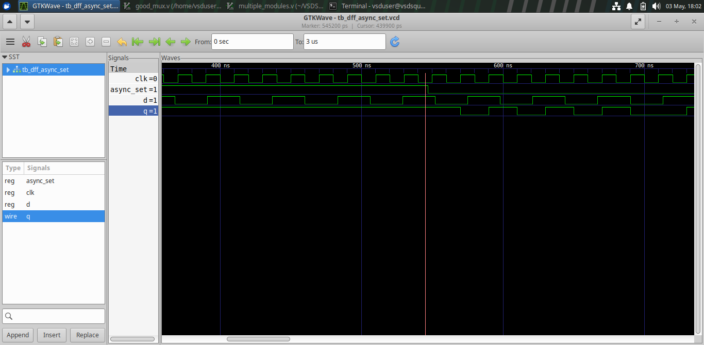

### 🔧 Yosys Output
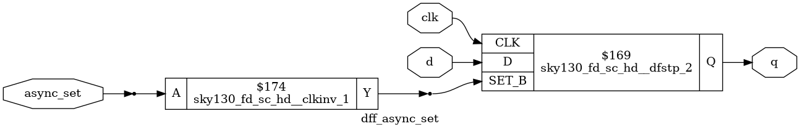

---

## 🔹 2. DFF with Asynchronous RESET

### 📊 GTKWave Outputs

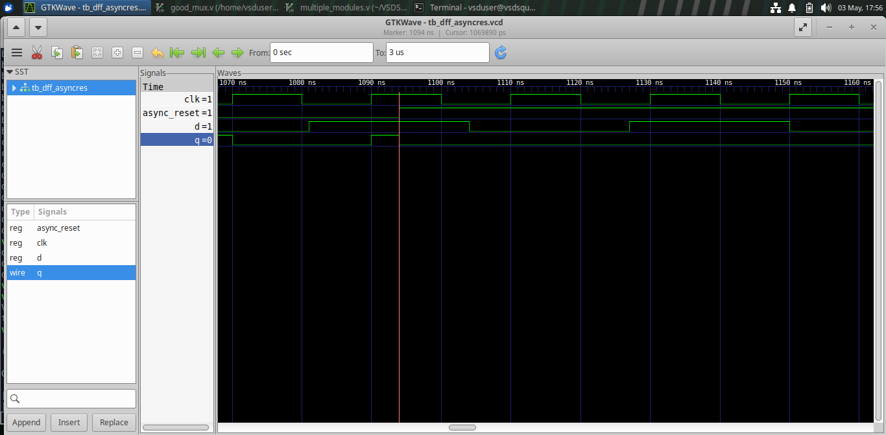

### 🔧 Yosys Output
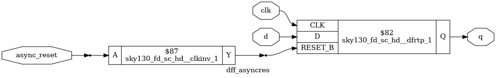

---

## 🔹 3. DFF with Synchronous RESET

### 📊 GTKWave Outputs
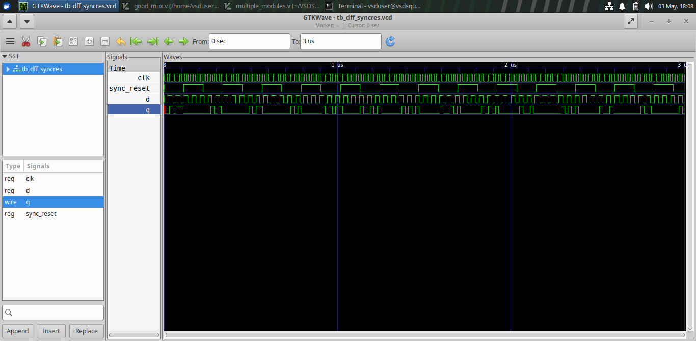

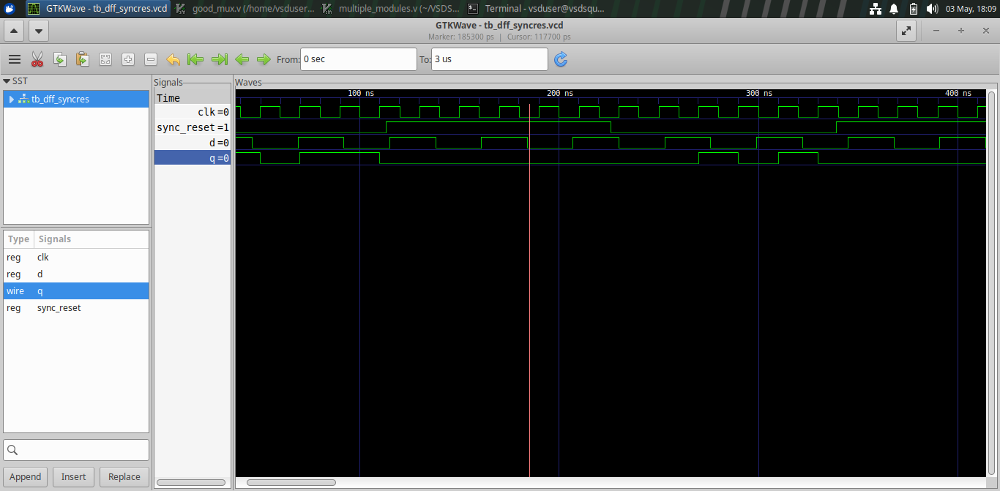

### 🔧 Yosys Output
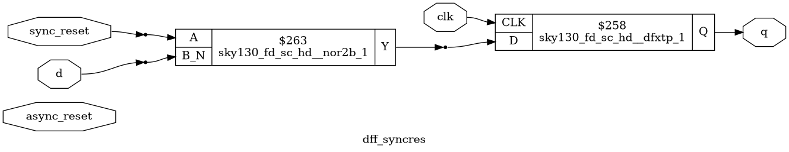

---

## 4: MULTIPLIERS

## 📜 Verilog Files
- `mult_2.v` – 2-bit multiplier
- `mult_8.v` – 8-bit multiplier
- `mul2_net.v`, `mult8_net.v` – synthesized netlists

## 📊 Simulation Outputs

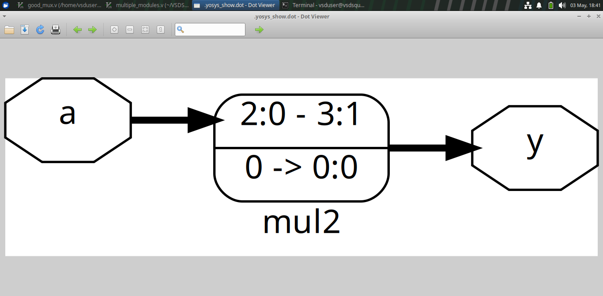

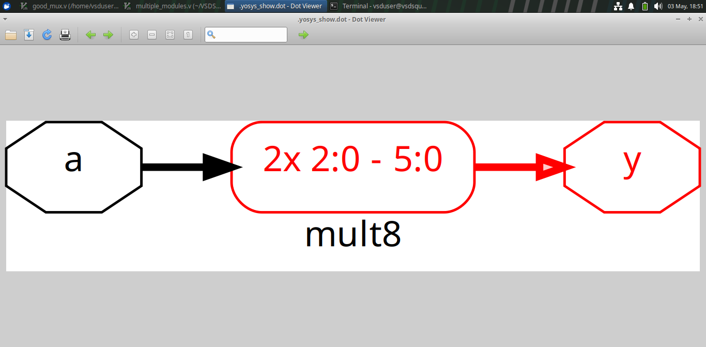

## 🔧 Synthesis Outputs

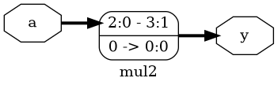

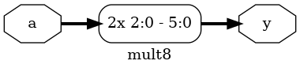

---

## 5: MULTIPLE MODULES (HIERARCHY vs FLAT)

## 📜 Verilog Files
- `multiple_modules_heir.v` – hierarchical design
- `multiple_modules_flat.v` – flattened design

## 📊 Outputs

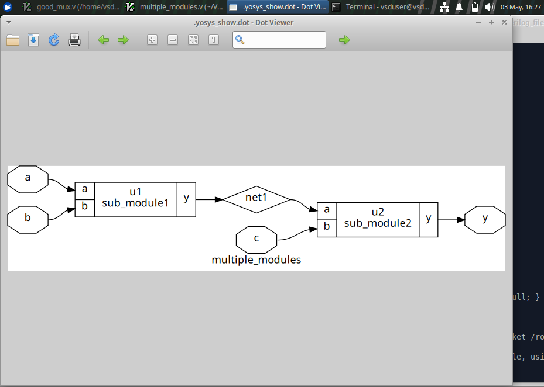

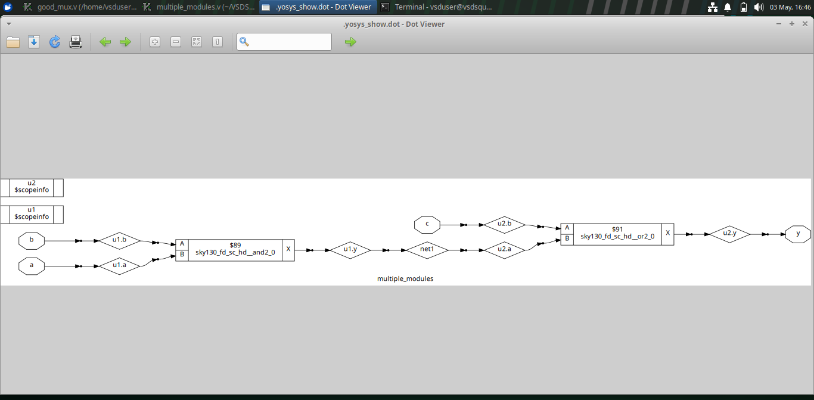

## 🔧 Synthesis

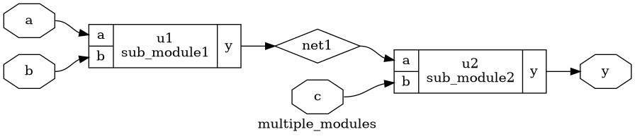

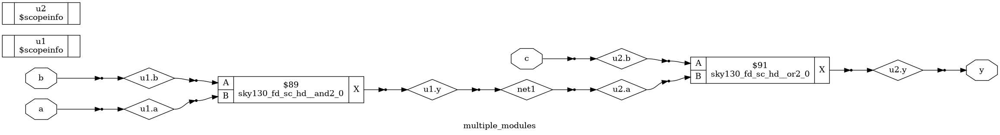

---

## 6: SUB MODULE

## 📊 Outputs

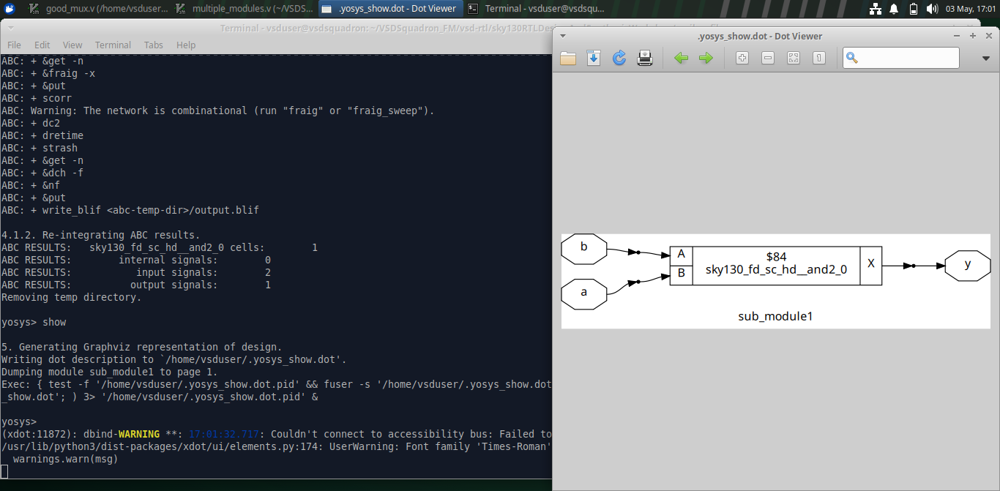

## 🔧 Synthesis

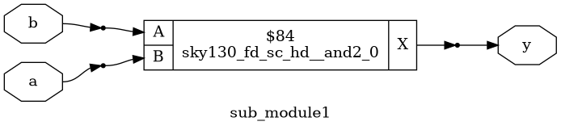

---

